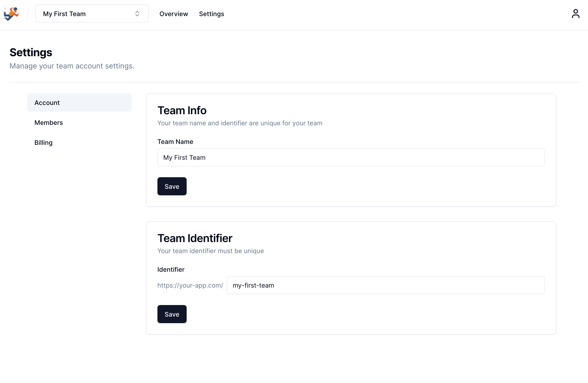

# Coding Challenge Repository

Dear Engineer,

this repository is meant for you as the template for a coding challenge. This repo is based on basejump and next js, but I added some basic features as a basis for our technical interview. As a preparation for the interview, please clone this repository and get the product up and running locally. Also it helps if you take a look at the code before so it is easier for you to solve the challenges during the interview. In the challenge we will take a look at the favourite feature. I will check your technical skills, problem solving abilities, code quality, talent for UIUX and communication skills. There will not be a right or wrong. 😊

You need to have Docker installed in order to run a local supabase with `npx supabase start`. You should also copy the `.env.template` file as a `.env.local` file to insert the proper environment variables (that you receive from starting supabase) in order for the next js app to be able to connect to supabase. When the app is running you can login with the test users from the `seed.sql` file.

The code repository is definitely far from perfect as is and some dependencies are already outdated as the time of writing, so please consider potential issues due to this when you work in this project. Reach out for questions or potential issues with this setup. Otherwise, I am happy to meet you. 🌟

Best regards

Just below you can find the original Readme of this template:

# Basejump Nextjs Starter

Adds a Nextjs starter app on top of [Basejump core](https://github.com/usebasejump/basejump). This is a complete interface with support for personal accounts, team accounts, invitations, managing members/permissions and subscription billing.

[Learn more at usebasejump.com](https://usebasejump.com). Ask questions [on X / Twitter](https://twitter.com/tiniscule)

## Basejump Core Features

- **Personal accounts**: Every user that signs up using Supabase auth automatically gets their own personal account.
  Billing on personal accounts can be enabled/disabled.
- **Team accounts**: Team accounts are billable accounts that can be shared by multiple users. Team accounts can be
  disabled if you only wish to allow personal accounts. Billing on team accounts can also be disabled.
- **Permissions**: Permissions are handled using RLS, just like you're used to with Supabase. Basejump provides
  convenience methods that let you restrict access to rows based on a user's account access and role within an account
- **Billing**: Basejump provides out of the box billing support for Stripe, but you can add your own providers easily.
  If you do, please consider contributing them so others can benefit!
- **Testing**: Basejump is fully tested itself, but also provides a suite of testing tools that make it easier to test
  your own Supabase functions and schema. You can check it out
  at [database.dev/basejump/supabase_test_helpers](https://database.dev/basejump/supabase_test_helpers). You do not need
  to be using Basejump to use the testing tools.

## Next Frontend Features

- **Basic Dashboard**: A basic dashboard implementation restricted to authenticated users
- **User Authentication**: Support for email/password - but add any auth provider supported by Supabase
- **Personal accounts**: Every user that signs up using Supabase auth automatically gets their own personal account.
  Billing on personal accounts can be enabled/disabled.
- **Team accounts**: Team accounts are billable accounts that can be shared by multiple users. Team accounts can be
  disabled if you only wish to allow personal accounts. Billing on team accounts can also be disabled.
- **Billing**: Basejump provides out of the box billing support for Stripe, but you can add your own providers easily.
  If you do, please consider contributing them so others can benefit!

## Quick Start

1. Run `yarn install`
2. Run `supabase start`
3. Create a `.env.local` copy of the `.env.example` file with the correct values for Supabase
4. Run `yarn dev`

When you're ready to work on billing, you'll need to set up a Stripe account and add your Stripe keys to your `supabase/functions/.env` file. There's an example file you can copy.

## Helpful Links

- [Basejump Docs](https://usebasejump.com/docs)
- [Creating new protected tables](https://usebasejump.com/docs/example-schema)
- [Testing your Supabase functions](https://usebasejump.com/docs/testing)

## Contributing

Yes please! Please submit a PR with your changes to [the basejump-next github repo](https://github.com/usebasejump/basejump-next).

You can contribute in the following places:

- [Basejump core](https://github.com/usebasejump/basejump)
- [Basejump Nextjs](https://github.com/usebasejump/basejump-next)
- [Basejump edge functions / billing functions](https://github.com/usebasejump/basejump-deno-packages)
- [Supabase Test Helpers](https://github.com/usebasejump/supabase-test-helpers)
